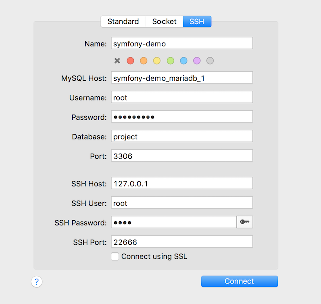

[](https://github.com/speto/docker-db-tunnel/tags)
[](https://github.com/speto/docker-db-tunnel/releases)
[](https://github.com/speto/docker-db-tunnel/stargazers)
[](https://github.com/speto/docker-db-tunnel/blob/master/LICENSE)
[](https://twitter.com/intent/tweet?text=Avoid%20an%20exposed%20container%20port%20conflicts%20when%20using%20databases%20in%20multiple%20docker%20projects%20during%20development%20on%20localhost%20%23docker%20%23dockerDBtunnel&url=https%3A%2F%2Fgithub.com%2Fspeto%2Fdocker-db-tunnel)


# Docker DB tunnel

Simple tool to avoid an exposed container port conflicts when using databases in multiple docker projects. 
Main idea is to use the ssh tunnel and connect all databases to one network with sshd container.  


Inspired by [nginx-proxy](https://github.com/jwilder/nginx-proxy) Automated Nginx Reverse Proxy for Docker.  
It uses [sickp/alpine-sshd](https://hub.docker.com/r/sickp/alpine-sshd/) A lightweight OpenSSH Docker Image built atop Alpine..

## Install

Download via

```shell
git clone https://github.com/speto/docker-db-tunnel
```

## Usage

Start some example dummy mariadb containers from multiple compose files.  
More details in [./example/ folder](./example/) or next sectiion about [docker-compose services example](#docker-compose-services-example):

```shell
$ cd ./example
$ docker-compose up -d
Creating network "docker-db-tunnel-example_default" with the default driver
Creating symfony-demo_mariadb_1  ... done
Creating symfony-demo2_mariadb_1 ... done
Creating project_mysql_1         ... done
```

Run `./docker-db-tunnel.sh` shell script to create `sshd` container, tunnel network and connect `sshd` and all (database) containers with name matching `mariadb|mysql` pattern (customizable by `DB_CONTAINER_NAME_PATTERN`):

```shell
$ ./docker-db-tunnel.sh
Running db tunnel container db-tunnel-sshd on port 22666
668e40197c800a612ea748b9778d3f0888333673f7588d4a0bb1e027bd5d22d4
Creating db tunnel network: db-tunnel-network
164e5a3c3b446169f928a03c135594493843664fef5ffa3edf820dd5de06f0a1
Connecting db-tunnel-sshd to db-tunnel-network
Connecting symfony-demo_mariadb_1 to db-tunnel-network
Connecting symfony-demo2_mariadb_1 to db-tunnel-network
Connecting project_mysql_1 to db-tunnel-network with hostname (alias) project_db_host
```

### Docker-compose services example

Uses [bianjp/mariadb-alpine](https://hub.docker.com/r/bianjp/mariadb-alpine/) Lightweight MariaDB docker image based on Alpine Linux.  
Fully compatible with [official MariaDB image](https://hub.docker.com/_/mariadb/)

[./example/docker-compose-project.yml](./example/docker-compose-project.yml)  

```yaml
services:
  project_mysql:
    container_name: project_mysql_1
    image: bianjp/mariadb-alpine:latest
    environment:
      - MYSQL_ALLOW_EMPTY_PASSWORD=yes
    labels:
      - db.network.tunnel.hostname=project_db_host
```
- You can set the stable hostname via `db.network.tunnel.hostname` container label which is later used as the network connection alias

[./example/docker-compose-symfony-demo.yml](./example/docker-compose-symfony-demo.yml)
```yaml
services:
  symfony-demo_mariadb:
    container_name: symfony-demo_mariadb_1
    image: bianjp/mariadb-alpine:latest
    environment:
    - MYSQL_ALLOW_EMPTY_PASSWORD=yes
```

### SSH Tunnel settings

The **root** password for SSH in `sickp/alpine-sshd` is "**root**".  
You can also [change default root password](https://github.com/sickp/docker-alpine-sshd#change-root-password).

### Database connection settings example

```
MySQL host: project_mysql_1
# or stable hostname via container label and network connection alias:  
MySQL host: project_db_host
Username: root
Port: 3306

SSH Host: 127.0.0.1
SSH User: root
SSH Password: root
SSH Port: 22666
```



## Customize

It is easy to extend via your own [.env](.env.dist) file:

```dotenv
DB_TUNNEL_NETWORK=db-tunnel-network
DB_TUNNEL_NETWORK_HOSTNAME_LABEL=db.network.tunnel.hostname
DB_TUNNEL_CONTAINER_NAME=db-tunnel-sshd
DB_TUNNEL_CONTAINER_PORT=22666
DB_CONTAINER_NAME_PATTERN="mariadb|mysql" #pattern for docker ps filtering
```

### MIT license

Copyright (c) 2018, Štefan Peťovský
